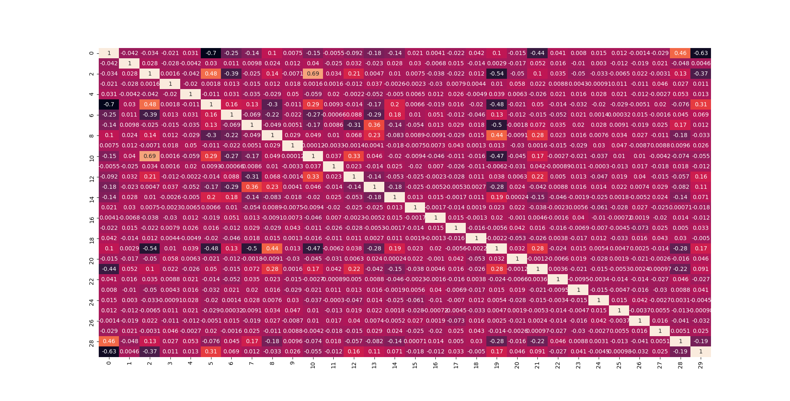

# Задача 1

## Гистограммы признаков

### Обучающая выборка

### Обучающая выборка по классам (выборочно)

### Тестовая выборка

## Корреляция Пирсона

### Обучающая выборка

### Тестовая выборка

### Отклонения корреляции между обучающей и тестовой выборками

Разница коэффиентов корреляции более чем на 0.5 для каждого признака 
между связью признаков в обучающей и тестовой выборках

    В явном виде:
    
    Номер признака | Список признаков с отклонением в корреляции
    
    19 [3, 4, 11, 12, 17, 18, 20, 22, 23, 24, 26, 27]
    29 [3, 7, 9, 15, 16, 17, 20, 23, 24, 25, 26, 27]
    28 [1, 3, 4, 5, 11, 15, 16, 17, 18, 20, 22, 24, 26, 27]
    0 [1, 3, 4, 9, 11, 15, 16, 17, 18, 20, 22, 23, 24, 25, 26, 27]
    5 [1, 3, 4, 9, 11, 15, 16, 17, 18, 20, 22, 23, 24, 25, 27, 28]
    8 [1, 2, 3, 4, 9, 10, 15, 16, 18, 20, 22, 23, 24, 25, 26, 27]
    12 [1, 3, 4, 6, 9, 11, 15, 16, 17, 19, 20, 22, 24, 25, 26, 27]
    6 [1, 3, 4, 7, 9, 11, 12, 15, 16, 18, 20, 21, 22, 23, 24, 25, 26]
    2 [1, 3, 4, 7, 8, 9, 11, 13, 14, 15, 16, 17, 20, 22, 23, 24, 26, 27]
    10 [1, 3, 4, 8, 9, 11, 13, 14, 15, 17, 18, 20, 22, 23, 24, 25, 26, 27]
    14 [1, 2, 3, 4, 7, 9, 10, 11, 15, 16, 17, 18, 20, 21, 23, 24, 26, 27]
    13 [1, 2, 3, 4, 9, 10, 11, 15, 16, 17, 18, 20, 21, 22, 23, 24, 25, 26, 27]
    7 [1, 2, 3, 4, 6, 9, 14, 15, 16, 17, 18, 20, 21, 22, 23, 24, 25, 26, 27, 29]
    21 [1, 3, 4, 6, 7, 9, 11, 13, 14, 15, 16, 17, 18, 20, 22, 23, 24, 25, 26, 27]
    22 [0, 1, 2, 4, 5, 6, 7, 8, 9, 10, 11, 12, 13, 15, 16, 17, 19, 20, 21, 25, 26, 27, 28]
    11 [0, 1, 2, 4, 5, 6, 9, 10, 12, 13, 14, 15, 16, 17, 19, 20, 21, 22, 23, 24, 25, 26, 27, 28]
    18 [0, 1, 3, 4, 5, 6, 7, 8, 9, 10, 13, 14, 15, 16, 17, 19, 20, 21, 23, 24, 25, 26, 27, 28]
    3 [0, 1, 2, 5, 6, 7, 8, 9, 10, 12, 13, 14, 15, 16, 18, 19, 20, 21, 23, 24, 25, 26, 27, 28, 29]
    17 [0, 1, 2, 4, 5, 7, 9, 10, 11, 12, 13, 14, 15, 16, 18, 19, 20, 21, 22, 24, 25, 26, 27, 28, 29]
    23 [0, 1, 2, 3, 4, 5, 6, 7, 8, 9, 10, 11, 13, 14, 15, 16, 18, 19, 20, 21, 24, 25, 26, 27, 29]
    25 [0, 1, 3, 4, 5, 6, 7, 8, 9, 10, 11, 12, 13, 15, 16, 17, 18, 20, 21, 22, 23, 24, 26, 27, 29]
    27 [0, 1, 2, 3, 4, 5, 7, 8, 9, 10, 11, 12, 13, 14, 15, 16, 17, 18, 19, 21, 22, 23, 25, 26, 28, 29]
    1 [0, 2, 3, 4, 5, 6, 7, 8, 9, 10, 11, 12, 13, 14, 15, 16, 17, 18, 20, 21, 22, 23, 24, 25, 26, 27, 28]
    4 [0, 1, 2, 5, 6, 7, 8, 9, 10, 11, 12, 13, 14, 15, 16, 17, 18, 19, 20, 21, 22, 23, 24, 25, 26, 27, 28]
    9 [0, 1, 2, 3, 4, 5, 6, 7, 8, 10, 11, 12, 13, 14, 15, 16, 17, 18, 20, 21, 22, 23, 24, 25, 26, 27, 29]
    16 [0, 1, 2, 3, 4, 5, 6, 7, 8, 9, 11, 12, 13, 14, 15, 17, 18, 20, 21, 22, 23, 24, 25, 26, 27, 28, 29]
    24 [0, 1, 2, 3, 4, 5, 6, 7, 8, 9, 10, 11, 12, 13, 14, 15, 16, 17, 18, 19, 20, 21, 23, 25, 26, 28, 29]
    15 [0, 1, 2, 3, 4, 5, 6, 7, 8, 9, 10, 11, 12, 13, 14, 16, 17, 18, 20, 21, 22, 23, 24, 25, 26, 27, 28, 29]
    20 [0, 1, 2, 3, 4, 5, 6, 7, 8, 9, 10, 11, 12, 13, 14, 15, 16, 17, 18, 19, 21, 22, 23, 24, 25, 26, 28, 29]
    26 [0, 1, 2, 3, 4, 6, 7, 8, 9, 10, 11, 12, 13, 14, 15, 16, 17, 18, 19, 20, 21, 22, 23, 24, 25, 27, 28, 29]

## Итог

    В итоге были выбраны признаки: 0, 2, 5, 6, 8, 10, 12, 13, 14, 19, 28, 29.
    
    Рассмотрены модели Catboost, SVM (с линейным ядром, радиально-базисной функцией).
    
    Точность:
        Public  0.820683282733131
        Private  0.820683282733131
    
    Расчёт баллов согласно MADE:
        result = 100 if y > 0.82 else (40 + (y - 0.6) / 0.22 * 60 if y > 0.6 else 0),
        где y — это ваш результат по метрике ROC-AUC. Количество баллов является округленным целым числом.
    