# Задача 2

## Пользователи

### Гистограмма признаков

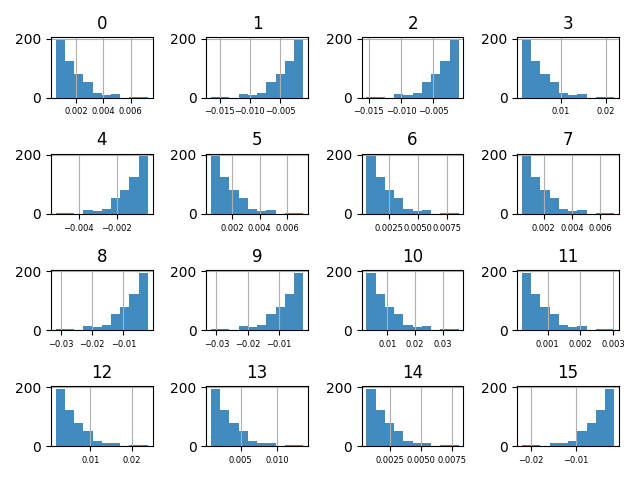

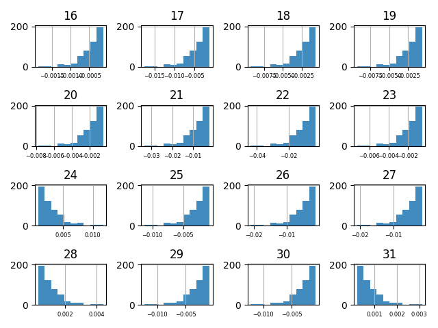

### Корреляция Пирсона (все пирзнаки - численные)

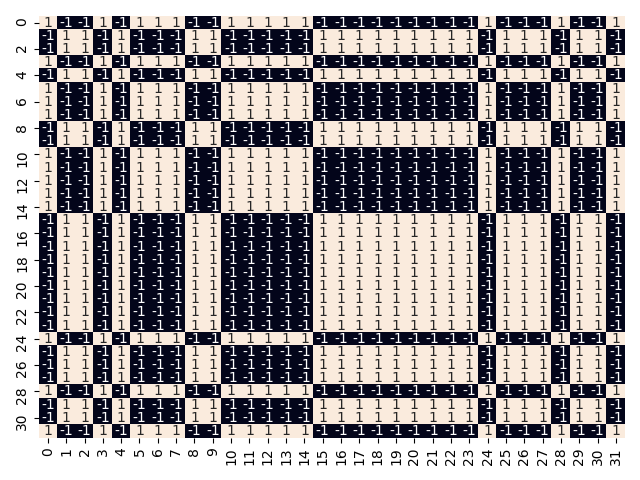

## Баннеры

### Гистограммы признаков

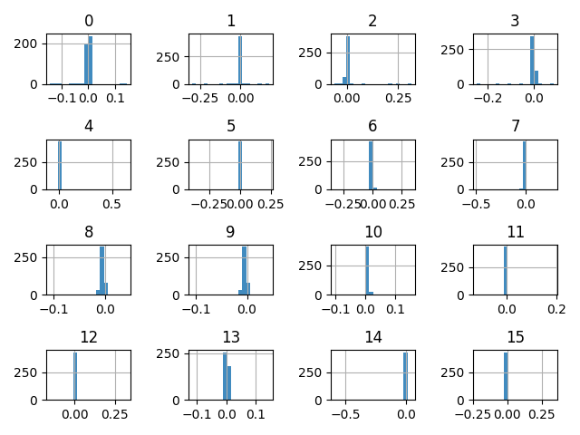

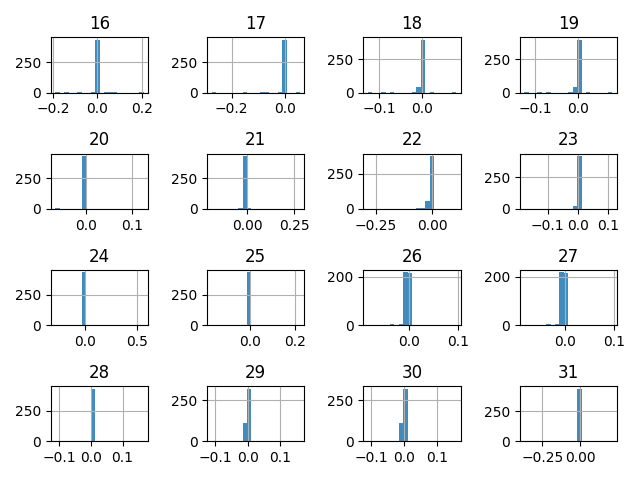

### Диаграмма размаха (boxplot) и гистограмма с большим *bins* (количеством интервалов)

#### Диаграмма размаха (выборочно)

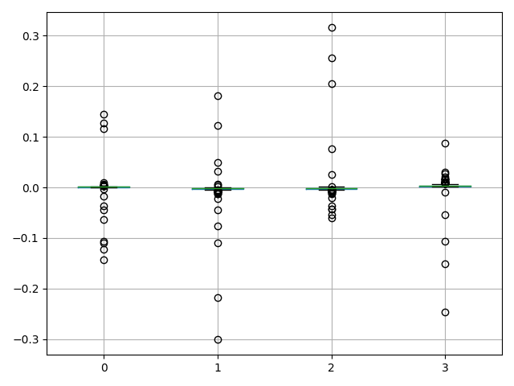

#### Гистограмма(выборочно)

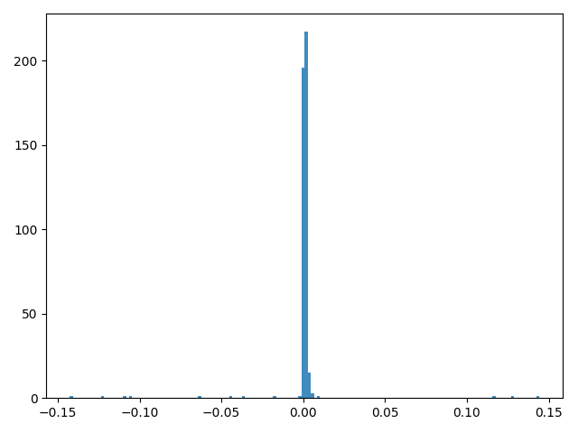
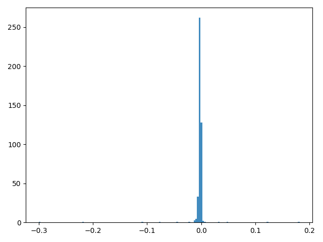
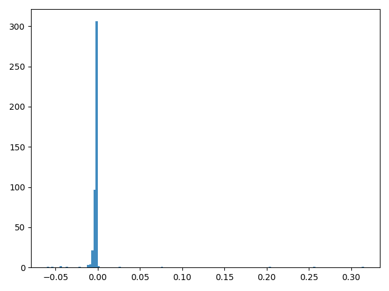
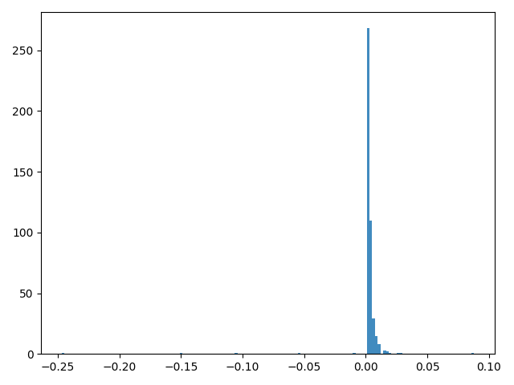

### Корреляция Пирсона (все признаки - численные)

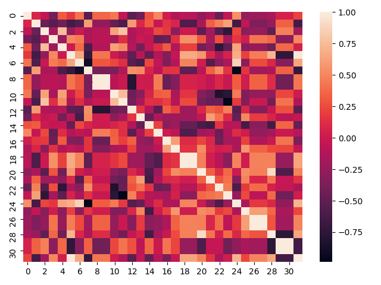

### Итерационный поиск выбросов в признаке с именем 0

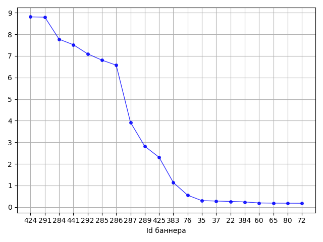

### Итерационный поиск выбросов с усреднением статистики (по которой производится определение шума) по всем признакам

    Банннеры на удаление: [441, 284, 285, 291, 424, 287, 286, 425, 289, 292]

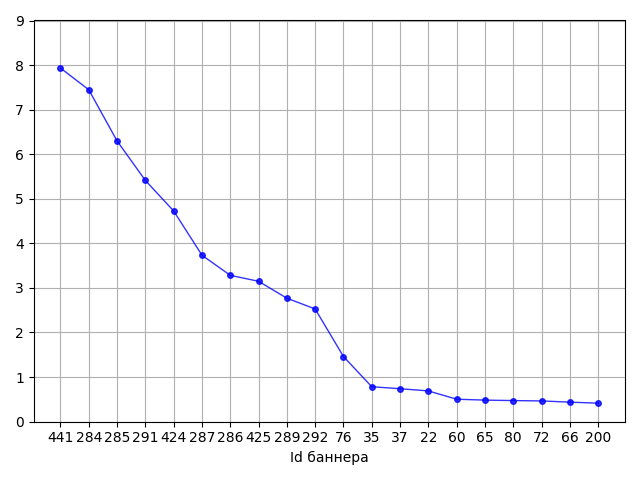

### Корреляция после удаления списка баннеров как выброс

#### Первый взгляд

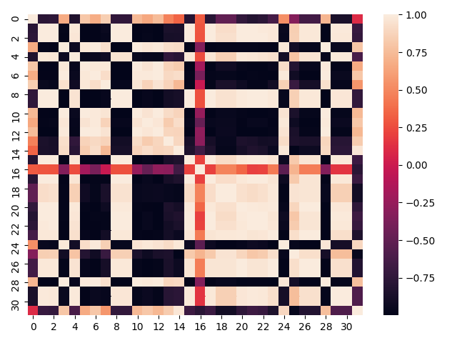

#### Диаграмма размаха признака с именем 16

    К ранее определённым выбросам добавлены ещё два: [441, 284, 285, 291, 424, 287, 286, 425, 289, 292] + [383, 384]

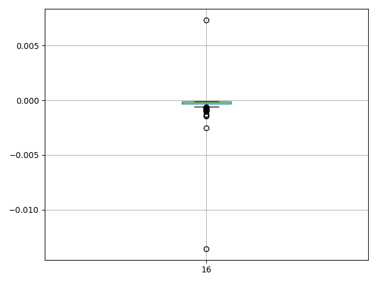

### Корреляция после пополнения списка баннеров в качестве выброса

### Дополнительно (для сравнения) - корреляция после робастной нормализации признаков

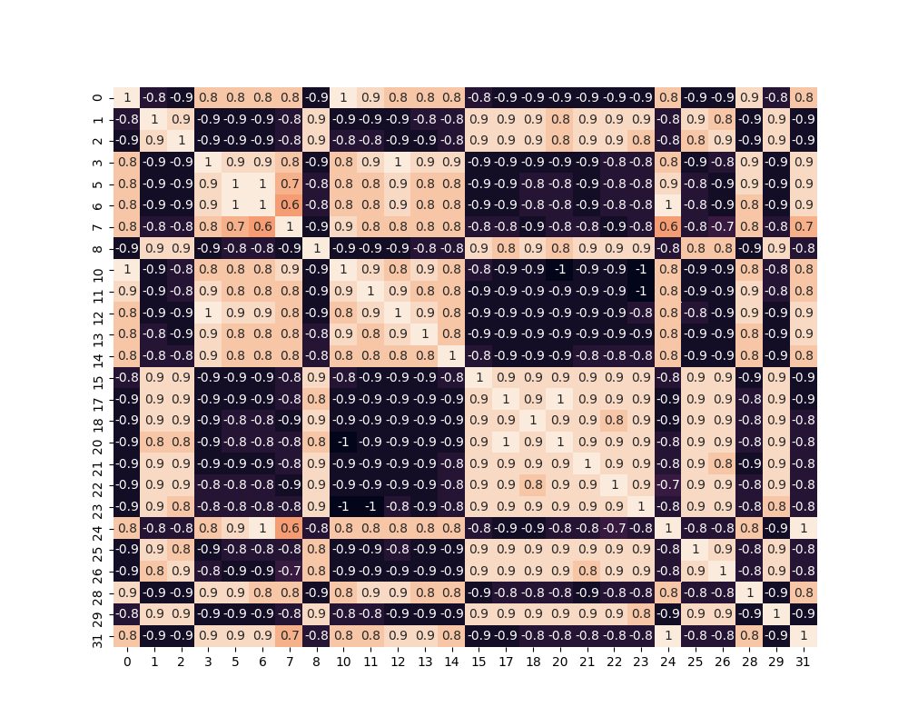

## Лайки-дизлайки

### Разница между количеством лайков и дизлайков для каждого баннера (по всем пользователям)

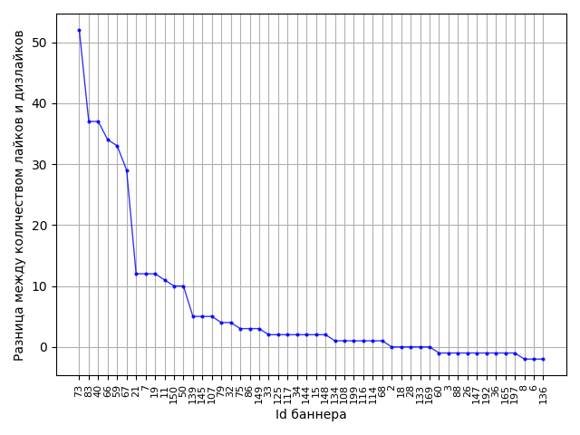

### Количество баннеров

    Количество баннеров с лайками: 203
    Количество баннеров без лайков: 241
